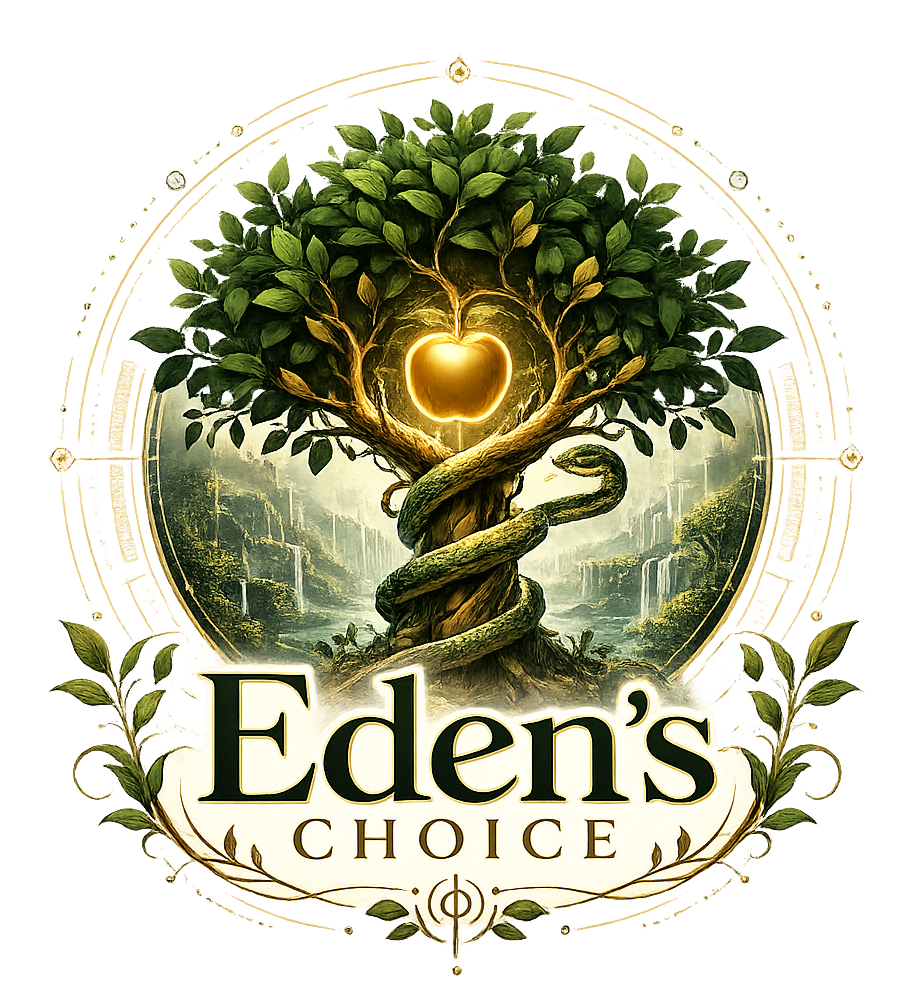

# Eden's Choice

*A Garden of Eden simulation — a storybook of the oldest choice ever made.*

**[▶ Play in your browser](https://davidfliesen.github.io/edens-choice)**

Built by [Cibola Studios](https://davidfliesen.github.io) · David "SunTzu" Fliesen

---

## About

Eden's Choice places you in a procedurally generated Garden of Eden as Adam. Walk the garden freely — every tree is pleasant to the sight and good for food. Deer graze in the clearings, doves circle the Tree of Life, fish leap from the river, and fireflies drift gold through the dusk.

But two trees stand apart in the midst of the garden. The Tree of Life, crowned with a radiant golden apple. And the Tree of the Knowledge of Good and Evil, where a serpent coils about the trunk and whispers that you shall not surely die.

What happens next is your choice. Choose well, and the garden is yours forever. Choose otherwise, and the sky itself will answer.

## Controls

| Input | Action |
|---|---|
| **WASD / Arrow Keys** | Walk |
| **Shift** | Run |
| **Space** | Jump |
| **Drag** (mouse or finger) | Look around |
| **I** | Interact — speak, eat, take fruit |
| **V** | Toggle first / third person |

## Features

The entire game is a single self-contained HTML file. The terrain, forest, river, and wildlife placement are generated procedurally from a fixed seed. The score is synthesized live with the Web Audio API — a pastoral pentatonic theme with birdsong that collapses into a tritone drone, wind, and thunder when the Fall begins. Eve wanders the garden as an NPC and will speak with you; the Serpent tempts with the words of Genesis 3; and if fruit is taken from either forbidden tree, the weather, light, and music turn, and the LORD God descends from the sky for the confrontation. All scripture is quoted from the King James Version (public domain).

## Technical Notes

Three.js r128 (CDN) · ES5 JavaScript throughout · procedural Web Audio score · no build step, no dependencies to install — open the file or serve it from any static host.

## Version History

| Version | Highlights |
|---|---|
| v001 | Core garden, both trees, Serpent, Eve, the Fall sequence, God's descent |
| v002 | Rebranded to Eden's Choice; logo title screen |
| v003 | Seamless ivory title screen matched to the emblem |
| v004 | Logo art direction applied to the world: waterfalls, gilt leaves, coiled serpent, hero apple, parchment UI |
| v005 | Living garden: deer, rabbits, doves, leaping fish, fireflies, violet mist, rebuilt jointed characters; favicon set |
| v006 | Storybook edition: illuminated intro pages, chapter cards, storybook ending |

---

*"And out of the ground made the LORD God to grow every tree that is pleasant to the sight, and good for food; the tree of life also in the midst of the garden, and the tree of knowledge of good and evil."* — Genesis 2:9

© 2026 Cibola Studios

